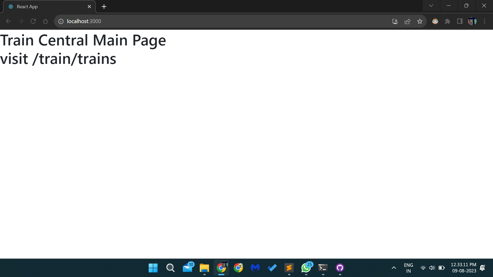
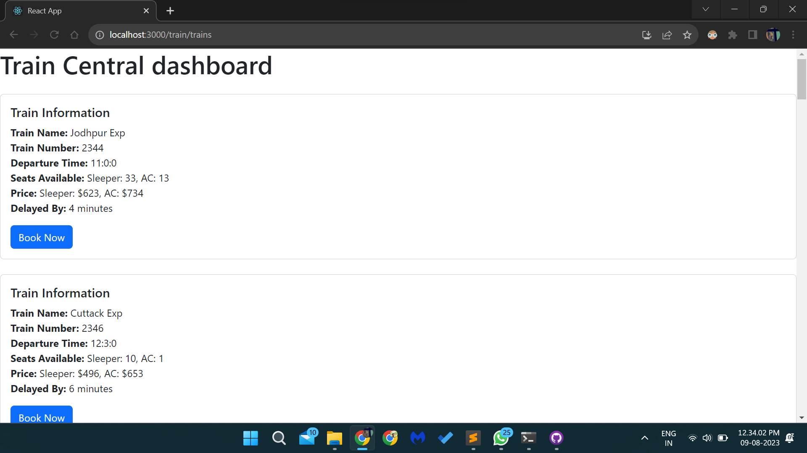
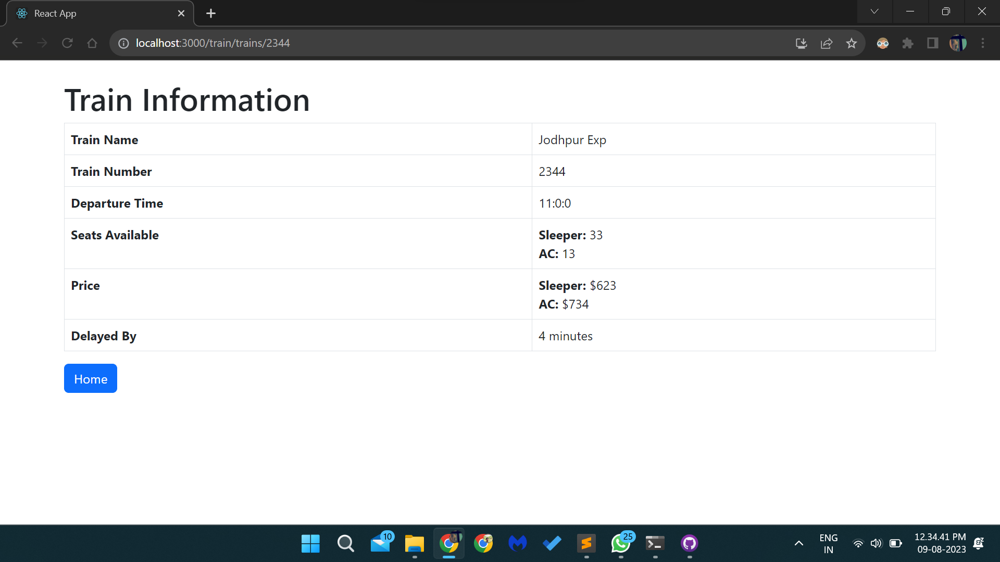

# Train Central

This project was bootstrapped with [Create React App](https://github.com/facebook/create-react-app).

### `npm run build` for production build

Builds the app for production to the `build` folder.\
It correctly bundles React in production mode and optimizes the build for the best performance.

The build is minified and the filenames include the hashes.\
Your app is ready to be deployed!

## Screenshots

### Main Landing Page

### /train/trains

### /train/trains/:trainid

